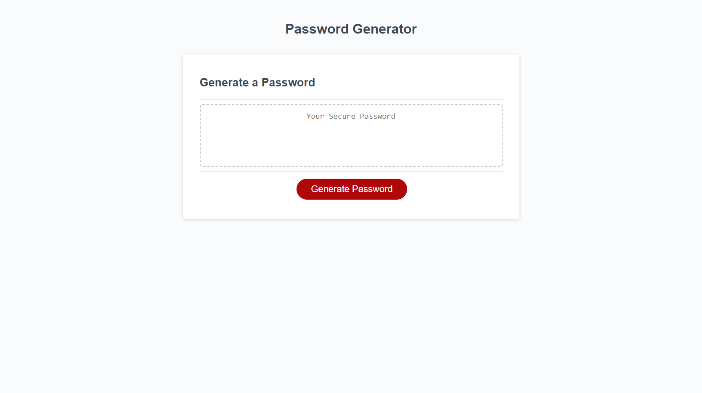

# Alex Clayton's Random Password Generator

## Introduction
This project was developed by Alex Clayton as part of the KU Coding Bootcampt 03-Javascript Challenge.  This is a random password generator web application using javascript to generate a unique password given a set of user-selected criteria.

## What's in the project?
The acceptance criteria for this project are as follows:

1.  WHEN I click the button to generate a password
    THEN I am presented with a series of prompts for password criteria

    An event listener was added to the button to execute the writePassword function when clicked.

2.  WHEN prompted for password criteria
    THEN I select which criteria to include in the password

    This was achieved using a window prompt for for the password character length user-selection and window confirms for the inclusion of the 4 unique types of characters.

3.  WHEN prompted for the length of the password
    THEN I choose a length of at least 8 characters and no more than 128 characters

    An else if conditional statement was added to the writePassword function that returns an error message using a window alert if the user-selection does not meet this criteria.  The function is then re-executed.

4.  WHEN asked for character types to include in the password
    THEN I confirm whether or not to include lowercase, uppercase, numeric, and/or special characters

    Once the user-selected amount of password characters meets the criteria specified above, these criteria are selected using window.confirm methods.

5.  WHEN I answer each prompt
    THEN my input should be validated and at least one character type should be selected

    The selections are validated and then confirmed using a window.alert method.  If none of the criteria are selected, an error message appears indicating at least one must be selected.  This message was also displayed using a window.alert method.

6.  WHEN all prompts are answered
    THEN a password is generated that matches the selected criteria

    A series of if/else if conditional statements were added to the writePassword function to validate the user-selected criteria.  The result is then held in an array placeholder until directed to be written in a specified location on the webpage.

7.  WHEN the password is generated
    THEN the password is either displayed in an alert or written to the page

    The generated array is then added into a string using the join() method and added to the webpage using a document.querySelector method.

## The completed project resembles the following image when deployed:

Full Size desktop view

## URL of the Deployed Application:

[Deployed Application](https://alexclaytonbootcamp.github.io/Module-3-Challenge-Passwords/)